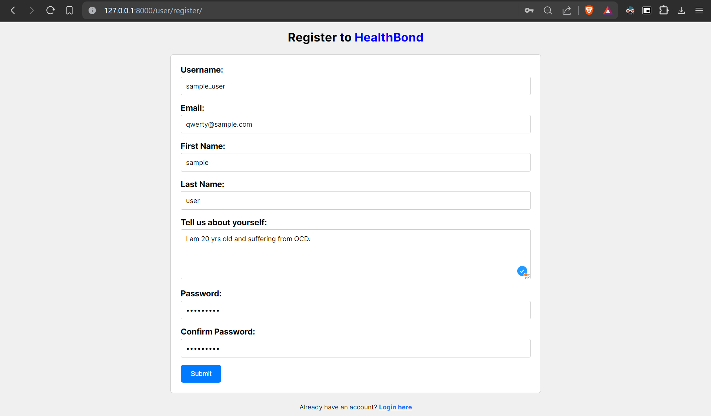
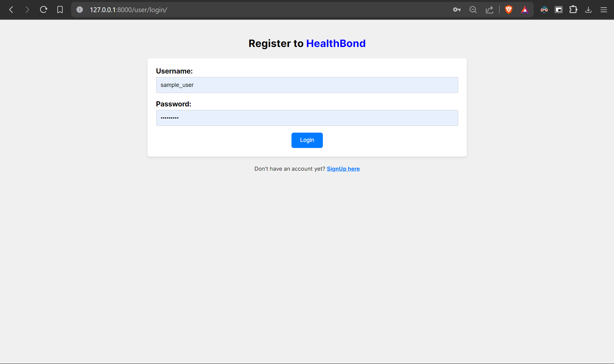
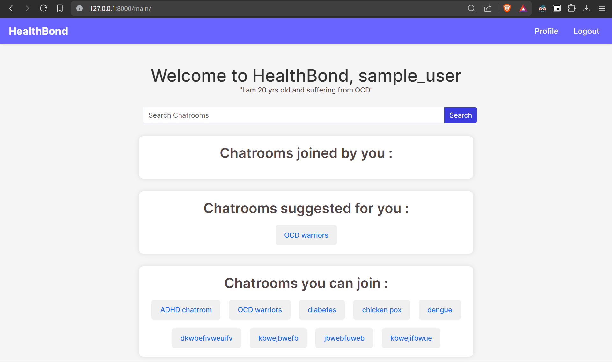
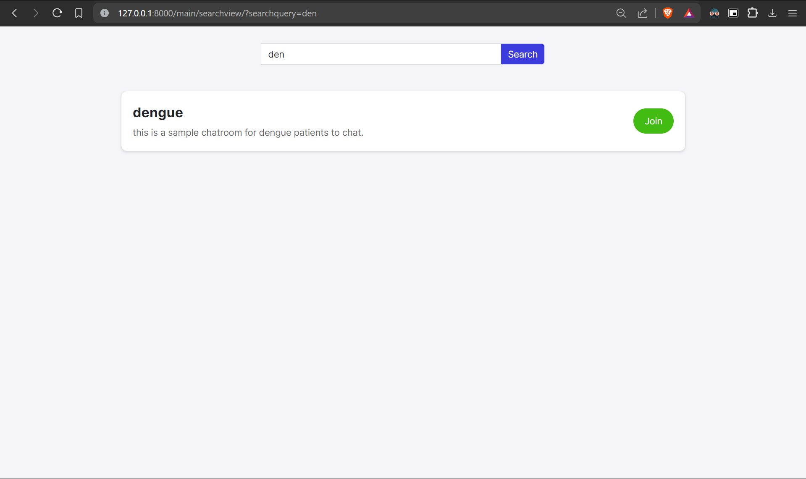
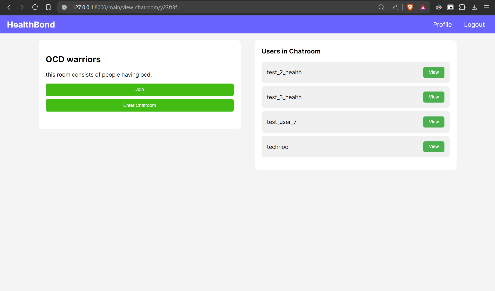
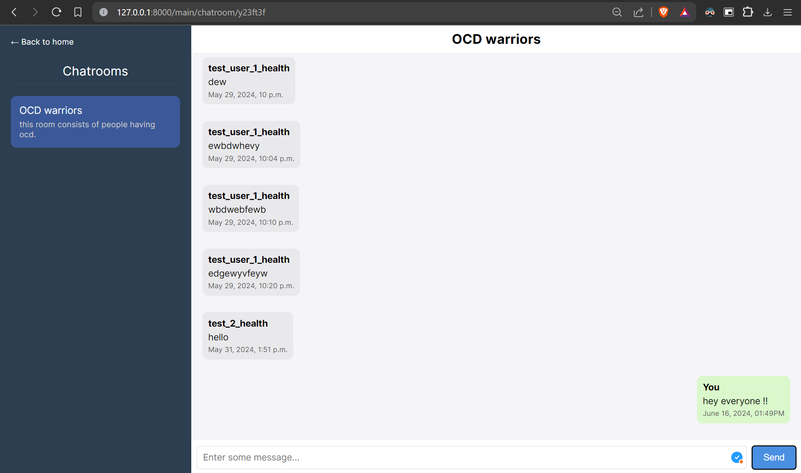
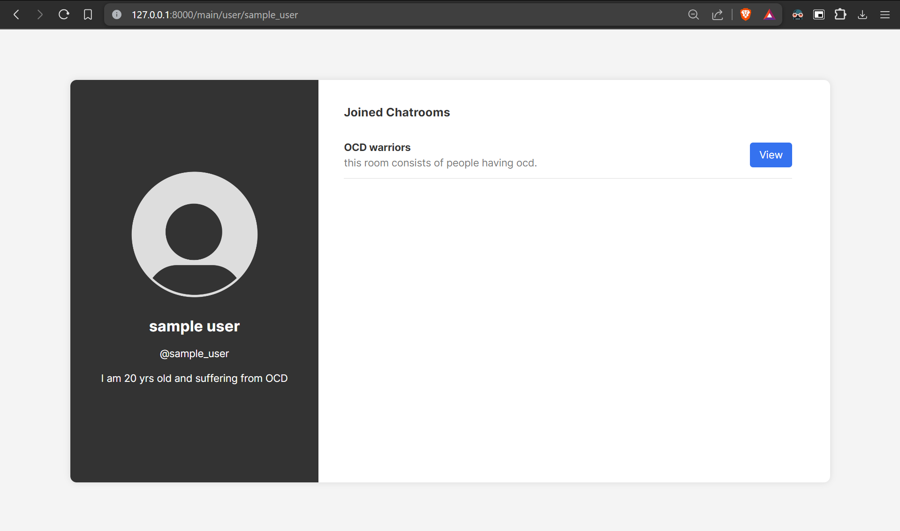

# HealthBond

## Description
HealthBond is a web application built using Django, JavaScript, HTML, and CSS. It helps individuals with similar illnesses connect and communicate through dedicated chatrooms. Users can register, login, create chatrooms, join existing ones, and manage their profile and chatroom memberships.

## Features
- **User Authentication**: Secure registration and login.
- **User Dashboard**: Personalized dashboard showing user details and joined chatrooms.
- **Chatrooms**: Dedicated chatrooms categorized by diseases.
- **Search Functionality**: Search for specific chatrooms.
- **Room Dashboards**: Each chatroom has its own dashboard for managing members and discussions.
- **Chatroom Suggestion**: Each user gets suggested some chatrooms on the basis of their bio using GEMINI AI API.

## Screenshots
<!-- Include screenshots here to visually represent your app -->
- 
- 
- 
- 
- 
- 
- 

## Installation
### Prerequisites
- Python (>= 3.10)
- Django

### Steps
1. **Clone the repository:**
   ```bash
   git clone [https://github.com/your/repository.git](https://github.com/Aditya-madwal/Health-Bond/)
   cd root
   ```
2. **Install dependencies:**
   ```bash
   pip install -r requirements.txt
   ```
3. **Make migrations:**
   ```bash
   python manage.py migrate
   ```
4. **Run the development server:**
   ```bash
   python manage.py runserver
   ```
5. Open your web browser and navigate to http://127.0.0.1:8000/user/register to start.

### Usage
1. Register a new account or login with existing credentials.
2. Explore suggested chatrooms and join those relevant to your illness.
3. Create a new chatroom if needed or search for existing ones.
4. Start chatting and connecting with others who share similar health conditions.

### Technologies Used
1. Django
2. JavaScript
3. HTML/CSS
4. SQLite (or your preferred database)
5. WebSockets
6. AJAX

### Contact
For any questions or feedback, feel free to contact us at your.email@example.com.
